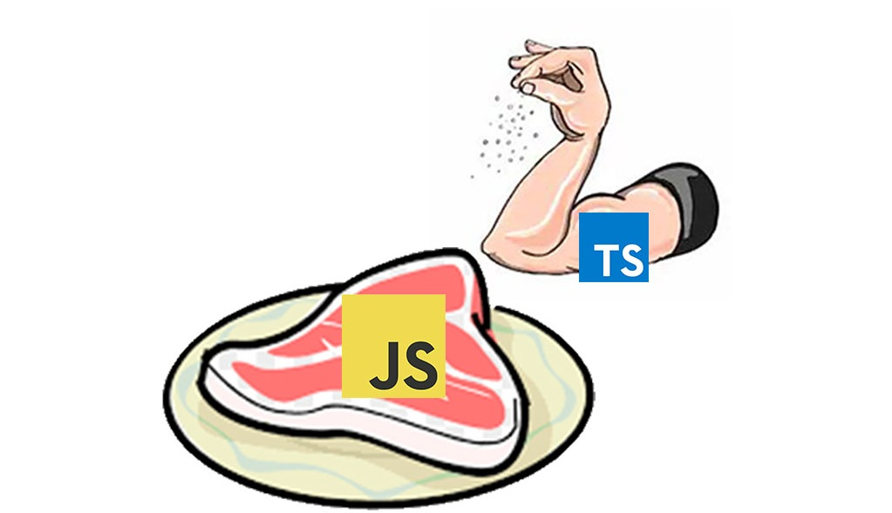

# Day 1: COMMING UP WITH NEW WORLD

## First inside

https://insights.stackoverflow.com/survey/2020

 

## Why we need learn or work with TypeScipt?

JavaScript its better, but TypeScript can improve your code better. How:

- TypeScript is `strange`? Yeah, but sound good if you influence  
- What actually TypeScript does is make the JavaScript better: `cover error case` `defined how type of variable` `make your code clean(!?)`,..  
- And: https://fettblog.eu/why-i-use-typescript/  

## Stand here, take a coffee. I & you, hommie. We keep the passion inside the heart, learn the good new in a good way~~

- What do they acctually do? with TS? Yeah.

| Kind                 | Expand                                                                                                                                                                                                                                                                                             |
| -------------------- | :------------------------------------------------------------------------------------------------------------------------------------------------------------------------------------------------------------------------------------------------------------------------------------------------- |
| `Working with Types` | We learn about some major features of TypeScript, like type annotations, type inference, and control flow. We will define primitive and complex types, and learn about the difference between types and interfaces. For every variable or constant we can create, we find a way to provide a type. |
| `Function`           | Functions are an essential feature in JavaScript, and we can                                                                                                                                                                                                                                       |

see that once we want to type function signatures.
We learn about function heads and bodies, structural typing
for functions, and how we can define different behavior for
the same function. |
| `Union and Intersection Types` | TypeScript’s type system can be seen as an endless space
of values, and types are nothing but discrete sets of values
inside this space. This allows for algebraic operations like
union and intersections, making it a lot easier for us to define concrete types for values. We learn about type widening and narrowing, top and bottom types, and how we can
influence control flow. |
| `Generics` | Generics are a way to prepare types for the unknown.
Whenever we know a certain behavior of a type but can’t
exactly say which type it affects, a generic helps us to model
this behavior. We learn about generic constraints, binding
generics, mapped types, and type modifiers |
| `Conditional Types` | Conditional types are arguably the most unique feature to
TypeScript’s type system. They allow us to introduce a level
of meta-programming unseen in programming languages,
where we can create if/else clauses to determine a type based
on the input type. This allows for a powerful set of tools we
can use to define model and behavior once, and make sure
we don’t end up in type maintenance hell. |
| `Thinking in Types` | The final chapter deals with situations you might encounter
in your everyday programming life. We use these situations
to get into a thinking-in-types mindset, where we take care
about a robust and well-defined set of types before starting
implementation. This helps us validate that what we code is
what we expect. |
